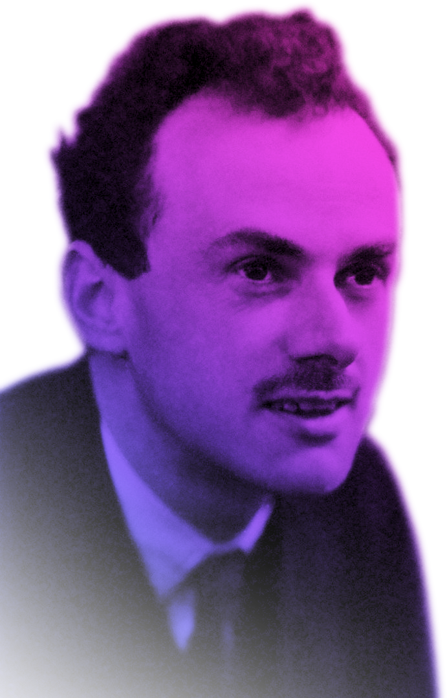

# THE DIRAC ENGINE: *A TRUBUTE TO A LEGEND*

    

## A Tribute to a Legend

The Dirac Engine is a C++ physics engine which simulates quantum phenomena. This includes basic quantum and wave mechanics, spin 1/2 particles and their antimatter partners in 1D, 2D and 3D. The engine is based on the Schrödinger, Pauli and Dirac equations.

In 1928 Paul Dirac, an english physicist, was working on a relativistic theory of quantum mechanics. The result of his work is a beautiful equation:

$$ i\hbar\gamma^\mu\partial_\mu\ket\psi - mc\ket\psi = 0 $$

This is the Dirac equation. It predicts electron spin, the periodic table, antimatter and the g factor. It is also the first building block of quantum field theory: оur best description of reality (yet).

This is why this name has been chosen for the project. The engine is a tribute to the legend: Paul Dirac, one of the geniuses of the 20th century.

    

Quantum field theory is hard. It requires years of studying just for the basics. But that is not the main problem. Calculations in quantum field theory are beyond the performance limits of modern computers. So, how could we simulate the quantum realm?

Fortunately, quantum field theory's predecessor: quantum mechanics, is easier. It does not require you to build a cluster of supercomputers. You can simulate basic quantum phenomena on your own computer or machine.

This is what the Dirac project does. You save time and performance while the engine solves complex quantum equations.